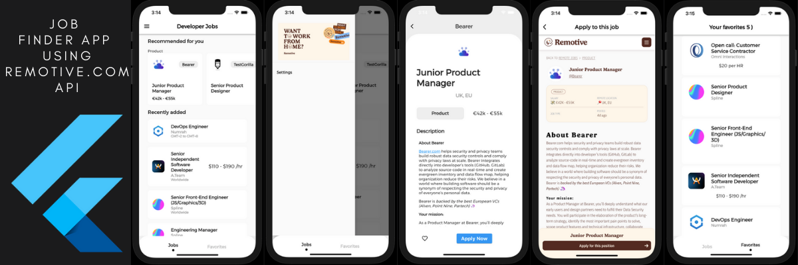

# flutter-architecture-in-action

The objective of this repo is to implement the different project architectures in Flutter

## The application 

The sample application is a **job finder application** using [Remote Jobs Api](https://github.com/remotive-com/remote-jobs-api). 

The idea is to implement many architectures with the same application : 

### 1 - Starter Project : 

- the starter project located in the `/starter` folder is a functional version of the application. But it is not an elegant implementation. So, this version is not really a maintainable one for a production kind of application.